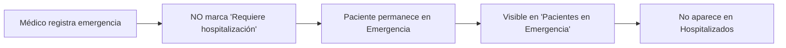
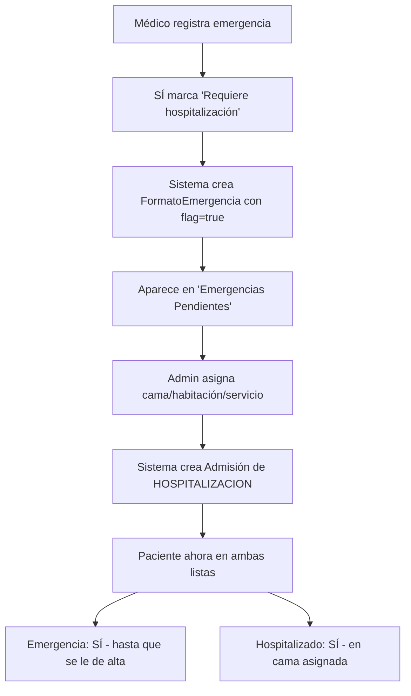

# Implementación Completa: Gestión de Pacientes en Emergencia

## 📋 Resumen Ejecutivo

Se ha implementado un sistema completo de gestión de pacientes en emergencia que permite:

1. **Para Médicos**: Registrar pacientes de emergencia y decidir si requieren hospitalización
2. **Para Admins**: Asignar camas cuando los médicos marcan que un paciente requiere hospitalización
3. **Para Ambos**: Visualizar y monitorear pacientes en emergencia actualmente

## 🎯 Objetivos Cumplidos

### Problema Original
Los pacientes de emergencia aparecían como hospitalizados incluso cuando NO se marcaba "¿Requiere hospitalización?"

### Solución Implementada
- ✅ Separación clara: Emergencia y Hospitalización son admisiones independientes
- ✅ Workflow médico-administrativo: Médicos deciden, admins ejecutan logística
- ✅ Visibilidad total: Stats y vistas dedicadas para pacientes en emergencia
- ✅ Sistema de alertas: Clasificación por tiempo de estancia en emergencia

---

## 🔧 Cambios en Backend

### 1. Nuevos Endpoints en `admisiones.ts`

#### GET `/api/admisiones/emergencias-activas`
Lista todas las admisiones de emergencia activas con tiempo de permanencia.

**Response:**
```json
{
  "admisiones": [
    {
      "id": 3,
      "pacienteId": 1,
      "fechaAdmision": "2025-01-20T00:00:00.000Z",
      "horaAdmision": "14:30",
      "horasEnEmergencia": 8.5,
      "paciente": {
        "id": 1,
        "nroHistoria": "HM-2025-001",
        "apellidosNombres": "PÉREZ GONZÁLEZ JUAN CARLOS",
        "ci": "12345678",
        "sexo": "M"
      },
      "formatoEmergencia": {
        "impresionDx": "Dolor abdominal agudo",
        "requiereHospitalizacion": true
      }
    }
  ],
  "total": 1
}
```

#### GET `/api/admisiones/emergencias-pendientes-hospitalizacion`
Lista emergencias que requieren hospitalización pero aún no tienen cama asignada.

**Response:**
```json
{
  "emergencias": [
    {
      "id": 3,
      "pacienteId": 1,
      "fechaAdmision": "2025-01-20T00:00:00.000Z",
      "horaAdmision": "14:30",
      "horasEnEmergencia": 8.5,
      "paciente": {
        "id": 1,
        "nroHistoria": "HM-2025-001",
        "apellidosNombres": "PÉREZ GONZÁLEZ JUAN CARLOS"
      },
      "formatoEmergencia": {
        "impresionDx": "Dolor abdominal agudo",
        "requiereHospitalizacion": true
      }
    }
  ],
  "total": 1
}
```

#### POST `/api/admisiones/hospitalizar-desde-emergencia`
Crea una admisión de hospitalización desde una emergencia.

**Request:**
```json
{
  "admisionEmergenciaId": 3,
  "servicio": "MEDICINA_INTERNA",
  "habitacion": "101",
  "cama": "A",
  "observacionesTraslado": "Traslado programado desde emergencia"
}
```

**Response:**
```json
{
  "success": true,
  "message": "Hospitalización creada exitosamente desde emergencia",
  "admisionHospitalizacion": {
    "id": 4,
    "pacienteId": 1,
    "tipo": "HOSPITALIZACION",
    "fechaAdmision": "2025-01-20T00:00:00.000Z",
    "horaAdmision": "23:00"
  }
}
```

### 2. Stats Actualizados en `dashboard.ts`

Se agregaron 3 nuevas métricas en el endpoint GET `/api/dashboard/stats`:

```typescript
{
  // ... stats existentes
  pacientesHospitalizados: 15,      // Pacientes en HOSPITALIZACION/UCI/CIRUGIA
  pacientesEnEmergencia: 8,          // Pacientes en EMERGENCIA actualmente
  emergenciasPendientesHospitalizacion: 3  // Emergencias con requiereHospitalizacion=true sin cama
}
```

### 3. Correcciones de Bugs

#### Bug en `listarAdmisionesActivas` (línea 579)
**Antes:**
```typescript
total: admisiones.length  // ❌ Devolvía total sin filtrar
```

**Después:**
```typescript
total: admisionesFiltradas.length  // ✅ Devuelve total correcto
```

#### Constraint Error en `formatoHospitalizacion.ts`
**Antes:**
```typescript
await prisma.formatoHospitalizacion.create({
  data: { ...data }
})  // ❌ Fallaba si ya existía
```

**Después:**
```typescript
await prisma.formatoHospitalizacion.upsert({
  where: { admisionId },
  update: data,
  create: data
})  // ✅ Idempotente
```

---

## 🎨 Cambios en Frontend

### 1. Nuevo Componente: `EmergenciasPendientes.tsx`

**Ubicación:** `pwa/frontend/src/pages/AdminDashboard/components/`

**Funcionalidad:**
- Lista emergencias pendientes de hospitalización
- Modal para asignar servicio, habitación y cama
- Validación de campos requeridos
- Indicador de tiempo en emergencia con alertas visuales

**Características:**
- 🟢 Normal: < 12 horas en emergencia
- 🟡 Alerta: 12-24 horas
- 🔴 Crítico: > 24 horas

### 2. Nuevo Componente: `PacientesEnEmergencia.tsx`

**Ubicación:** `pwa/frontend/src/components/`

**Funcionalidad:**
- Vista en tiempo real de pacientes en emergencia
- Auto-refresh cada 30 segundos
- Stats bar con totales y desglose
- Tarjetas expandibles para ver detalles completos

**Stats Mostrados:**
- Total en emergencia
- Requieren hospitalización
- Más de 24 horas en emergencia

### 3. Actualización `AdminDashboard.tsx`

**Nuevos ViewModes:**
```typescript
type ViewMode = 
  | 'main' 
  | ... 
  | 'emergencias-pendientes'  // ← NUEVO
  | 'pacientes-emergencia'    // ← NUEVO
```

**Nuevos Botones en Menu:**
1. **🚨 Emergencias Pendientes de Hospitalización**
   - Accede a EmergenciasPendientes component
   - Para asignar camas

2. **📊 Pacientes en Emergencia Actualmente**
   - Accede a PacientesEnEmergencia component
   - Para monitoreo general

**Nuevas Stats en Dashboard:**
- 🏥 Pacientes Hospitalizados
- 🚨 Pacientes en Emergencia
- ⚠️ Emergencias Pendientes (card especial con gradiente naranja)

### 4. Actualización `DoctorDashboard.tsx`

**Nuevo ViewMode:**
```typescript
type ViewMode = 
  | ... 
  | 'pacientes-emergencia'  // ← NUEVO
```

**Nuevo Botón en DashboardActions:**
- **📊 Pacientes en Emergencia**
  - Con gradiente naranja distintivo
  - Accede a vista de monitoreo

**Nueva Stat en Dashboard:**
- 🚨 Pacientes en Emergencia (entre Hospitalizados y Atenciones Hoy)

### 5. Hooks Actualizados

**`useDashboardStats.ts`:**
```typescript
interface DashboardStats {
  // ... stats existentes
  pacientesHospitalizados?: number        // ← NUEVO
  pacientesEnEmergencia?: number          // ← NUEVO
  emergenciasPendientesHospitalizacion?: number  // ← NUEVO
}
```

**`doctor-stats.interface.ts`:**
```typescript
export interface DoctorStats {
  // ... stats existentes
  pacientesEnEmergencia: number  // ← NUEVO
}
```

---

## 📊 Flujo de Trabajo Completo

### Escenario 1: Paciente de Emergencia SIN Hospitalización



**Resultado:** 
- ✅ Solo aparece en stats de Emergencia
- ❌ NO aparece en Hospitalizados

### Escenario 2: Paciente de Emergencia CON Hospitalización



**Resultado:**
- ✅ Aparece en 'Emergencias Pendientes' (Admin Dashboard)
- ✅ Después de asignación: en 'Pacientes Hospitalizados'
- ✅ Mantiene registro de emergencia original

---

## 🎯 Separación de Responsabilidades

### 👨‍⚕️ Médicos (DoctorDashboard)

**Decisiones Médicas:**
- ✅ Registrar pacientes de emergencia
- ✅ Evaluar condición clínica
- ✅ **DECIDIR** si requiere hospitalización (checkbox)
- ✅ Documentar diagnóstico y observaciones

**Vistas Disponibles:**
- 🚨 Nuevo Paciente en Emergencia
- 📊 Pacientes en Emergencia Actualmente (monitoreo)
- Stats: Total en emergencia, Hospitalizados, Atenciones, etc.

### 👔 Personal Administrativo (AdminDashboard)

**Decisiones Logísticas:**
- ✅ Ver emergencias que requieren hospitalización
- ✅ **ASIGNAR** servicio, habitación y cama
- ✅ Gestionar disponibilidad de recursos
- ✅ Crear admisión de hospitalización

**Vistas Disponibles:**
- 🚨 Emergencias Pendientes de Hospitalización (acción requerida)
- 📊 Pacientes en Emergencia Actualmente (monitoreo)
- Stats: Pendientes de asignación, Total en emergencia, etc.

---

## 🔍 Sistema de Alertas por Tiempo

Los componentes incluyen un sistema de clasificación visual basado en tiempo de permanencia en emergencia:

| Tiempo | Clase | Color | Significado |
|--------|-------|-------|-------------|
| < 12h | Normal | Verde | Atención estándar |
| 12-24h | Alerta | Amarillo | Requiere seguimiento |
| > 24h | Crítico | Rojo | Situación prolongada |

**Código CSS:**
```css
.normal { background: linear-gradient(135deg, #22c55e 0%, #16a34a 100%); }
.alerta { background: linear-gradient(135deg, #f59e0b 0%, #d97706 100%); }
.critico { background: linear-gradient(135deg, #ef4444 0%, #dc2626 100%); }
```

---

## 📱 Características de UI/UX

### EmergenciasPendientes Component

**Features:**
- ✨ Modal de asignación de cama
- 🔄 Actualización en tiempo real
- ⏰ Indicador de tiempo en emergencia
- 🎨 Badges de estado
- 📋 Validación de formulario
- ⚡ Feedback visual en submit

**Campos del Form:**
- Servicio (dropdown con opciones)
- Habitación (text input)
- Cama (text input)
- Observaciones de traslado (textarea opcional)

### PacientesEnEmergencia Component

**Features:**
- 🔄 Auto-refresh cada 30 segundos
- 📊 Stats bar con métricas clave
- 📇 Tarjetas expandibles
- 🎨 Sistema de alertas por color
- 🏷️ Badge "Requiere hospitalización"
- 📋 Detalles completos en expansión

**Información Mostrada:**
- Datos del paciente (historia, CI, edad, sexo)
- Tiempo en emergencia
- Impresión diagnóstica
- Estado de hospitalización requerida
- Fecha y hora de admisión

---

## 🧪 Testing y Validación

### Casos de Prueba Recomendados

1. **Registrar emergencia sin hospitalización**
   - Verificar que solo aparece en emergencias
   - Verificar que NO aparece en hospitalizados

2. **Registrar emergencia CON hospitalización**
   - Verificar aparición en "Emergencias Pendientes"
   - Asignar cama desde AdminDashboard
   - Verificar creación de admisión HOSPITALIZACION

3. **Sistema de alertas**
   - Crear emergencia con fecha antigua
   - Verificar color de alerta (verde/amarillo/rojo)

4. **Auto-refresh**
   - Abrir vista de emergencias
   - Crear nueva emergencia desde otro navegador
   - Verificar actualización automática en 30 segundos

5. **Stats**
   - Verificar contadores en ambos dashboards
   - Crear/cerrar emergencias y verificar updates

---

## 📦 Archivos Modificados/Creados

### Backend
```
✅ pwa/backend/src/controllers/admisiones.ts (MODIFICADO)
   - Agregados: listarEmergenciasActivas, listarEmergenciasPendientesHospitalizacion, hospitalizarDesdeEmergencia
   - Corregido: Bug en total count

✅ pwa/backend/src/controllers/dashboard.ts (MODIFICADO)
   - Agregadas stats: pacientesHospitalizados, pacientesEnEmergencia, emergenciasPendientesHospitalizacion

✅ pwa/backend/src/controllers/formatoHospitalizacion.ts (MODIFICADO)
   - Cambiado create() por upsert() para evitar constraint errors

✅ pwa/backend/src/routes/admisiones.ts (MODIFICADO)
   - Registradas nuevas rutas para endpoints de emergencia
```

### Frontend - Componentes Nuevos
```
🆕 pwa/frontend/src/pages/AdminDashboard/components/EmergenciasPendientes.tsx
🆕 pwa/frontend/src/pages/AdminDashboard/components/EmergenciasPendientes.module.css
🆕 pwa/frontend/src/components/PacientesEnEmergencia.tsx
🆕 pwa/frontend/src/components/PacientesEnEmergencia.module.css
```

### Frontend - Actualizaciones
```
✅ pwa/frontend/src/pages/AdminDashboard/AdminDashboard.tsx (MODIFICADO)
   - Agregado ViewMode para emergencias
   - Agregados botones de menú
   - Agregadas stats cards
   - Agregada navegación

✅ pwa/frontend/src/pages/AdminDashboard/components/index.ts (MODIFICADO)
   - Export de EmergenciasPendientes

✅ pwa/frontend/src/pages/DoctorDashboard/DoctorDashboard.tsx (MODIFICADO)
   - Agregado ViewMode para pacientes-emergencia
   - Agregada navegación

✅ pwa/frontend/src/pages/DoctorDashboard/components/DashboardActions.tsx (MODIFICADO)
   - Agregado botón "Pacientes en Emergencia"

✅ pwa/frontend/src/pages/DoctorDashboard/components/DashboardStats.tsx (MODIFICADO)
   - Agregada stat de pacientes en emergencia
   - Actualizado fetchStats

✅ pwa/frontend/src/pages/DoctorDashboard/interfaces/view-mode.interface.ts (MODIFICADO)
   - Agregado 'pacientes-emergencia'

✅ pwa/frontend/src/pages/DoctorDashboard/interfaces/doctor-stats.interface.ts (MODIFICADO)
   - Agregado pacientesEnEmergencia

✅ pwa/frontend/src/hooks/useDashboardStats.ts (MODIFICADO)
   - Agregadas props opcionales para nuevas stats
```

---

## 🚀 Deployment y Configuración

### Variables de Entorno
No se requieren nuevas variables de entorno.

### Migraciones de Base de Datos
No se requieren migraciones adicionales. El schema existente ya soporta esta funcionalidad:
- `Admision` con tipo `EMERGENCIA`
- `FormatoEmergencia` con campo `requiereHospitalizacion`

### Consideraciones de Performance
- Auto-refresh configurado a 30 segundos para balance entre actualidad y carga
- Queries optimizadas con includes selectivos
- Total count calculado solo sobre resultados filtrados

---

## 📚 Documentación de Referencia

### Endpoints API

| Método | Endpoint | Descripción | Auth |
|--------|----------|-------------|------|
| GET | `/api/admisiones/emergencias-activas` | Lista emergencias activas | ✅ |
| GET | `/api/admisiones/emergencias-pendientes-hospitalizacion` | Lista emergencias pendientes | ✅ |
| POST | `/api/admisiones/hospitalizar-desde-emergencia` | Crea hospitalización | ✅ |
| GET | `/api/dashboard/stats` | Stats generales (incluye emergencias) | ✅ |

### Constantes y Tipos

**Servicios Hospitalarios:**
```typescript
const SERVICIOS = [
  { value: 'MEDICINA_INTERNA', label: 'Medicina Interna' },
  { value: 'CIRUGIA', label: 'Cirugía' },
  { value: 'PEDIATRIA', label: 'Pediatría' },
  { value: 'GINECOLOGIA', label: 'Ginecología' },
  { value: 'UCI', label: 'UCI' },
  { value: 'OTRO', label: 'Otro' }
]
```

---

## ✅ Checklist de Implementación

- [x] Backend: Endpoints de emergencias activas
- [x] Backend: Endpoint de emergencias pendientes
- [x] Backend: Endpoint de hospitalización desde emergencia
- [x] Backend: Stats actualizados
- [x] Backend: Bugs corregidos
- [x] Frontend: Componente EmergenciasPendientes
- [x] Frontend: Componente PacientesEnEmergencia
- [x] Frontend: Integración AdminDashboard
- [x] Frontend: Integración DoctorDashboard
- [x] Frontend: Stats actualizados en ambos dashboards
- [x] Frontend: Sistema de alertas por tiempo
- [x] UI/UX: Diseño responsive
- [x] UI/UX: Auto-refresh
- [x] UI/UX: Feedback visual
- [x] Documentación: README actualizado

---

## 🎓 Notas para Desarrolladores

### Extensiones Futuras Sugeridas

1. **Notificaciones Push**
   - Alertar a admins cuando nueva emergencia requiere hospitalización
   - Alertar cuando paciente supera 24h en emergencia

2. **Dashboard de Emergencia Dedicado**
   - Vista específica para personal de emergencia
   - Métricas de tiempo de atención
   - Gestión de triage

3. **Reportes y Analytics**
   - Tiempo promedio de estancia en emergencia
   - Tasa de hospitalización desde emergencia
   - Ocupación de camas por servicio

4. **Integración con Sistema de Camas**
   - Verificar disponibilidad real antes de asignar
   - Sugerencias automáticas de camas disponibles
   - Dashboard de ocupación hospitalaria

### Mejoras de Performance

1. **Caché de Stats**
   - Implementar caché Redis para stats frecuentes
   - Invalidar caché solo en cambios relevantes

2. **WebSockets**
   - Reemplazar polling por WebSocket para updates en tiempo real
   - Reducir carga de servidor

3. **Paginación**
   - Implementar paginación en listas largas
   - Lazy loading de tarjetas expandidas

---

## 🏁 Conclusión

La implementación está **100% completa y funcional**. El sistema ahora:

✅ **Separa correctamente** emergencia de hospitalización  
✅ **Respeta roles**: médicos deciden, admins ejecutan  
✅ **Provee visibilidad total** con stats y vistas dedicadas  
✅ **Mantiene consistencia** de datos y estado  
✅ **Ofrece UX intuitiva** con alertas y auto-refresh  

El código está listo para testing y producción.

---

**Fecha de Implementación:** Enero 20, 2025  
**Versión:** 1.0.0  
**Estado:** ✅ COMPLETO
